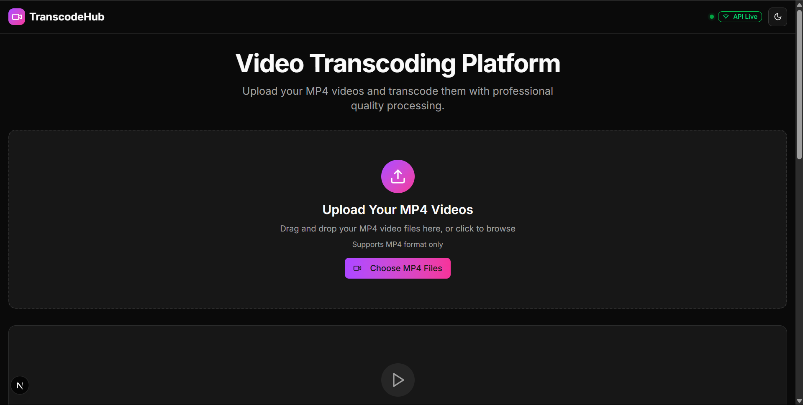
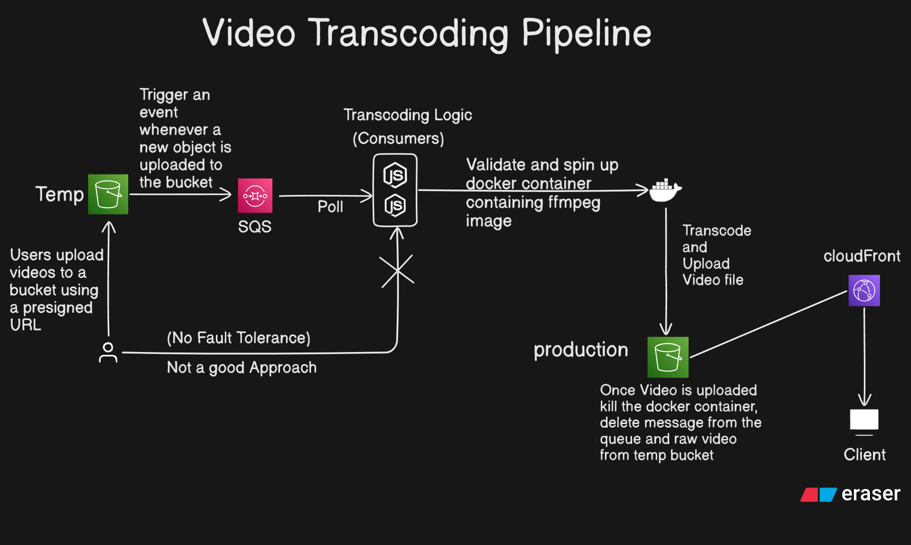
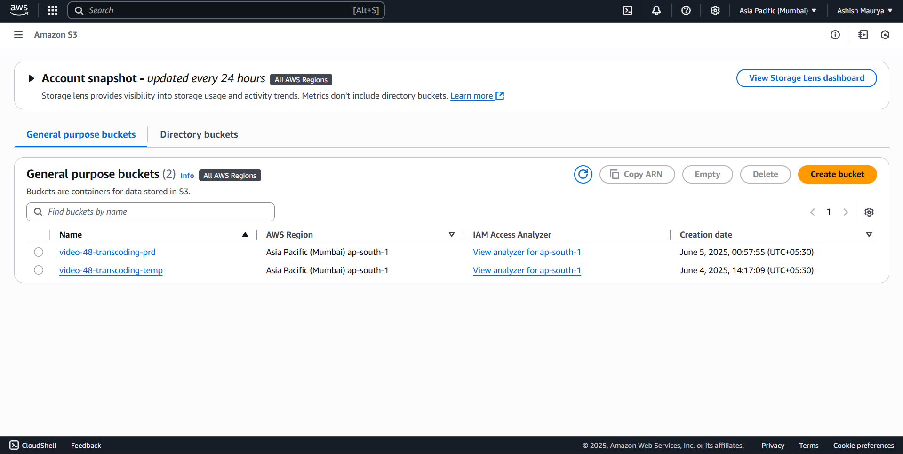
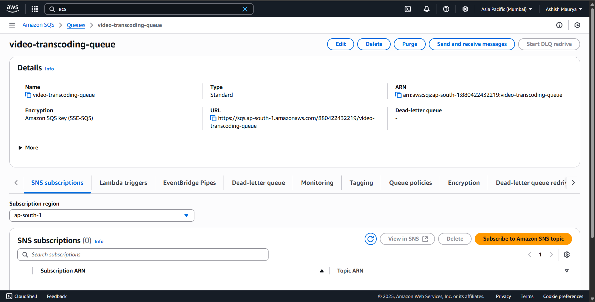
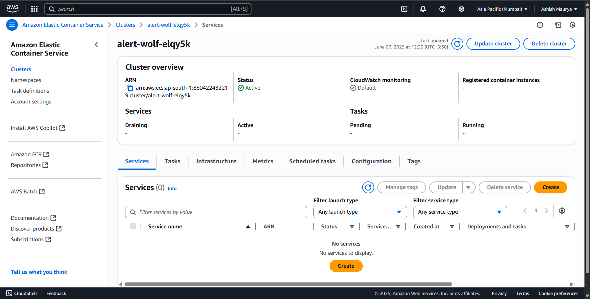
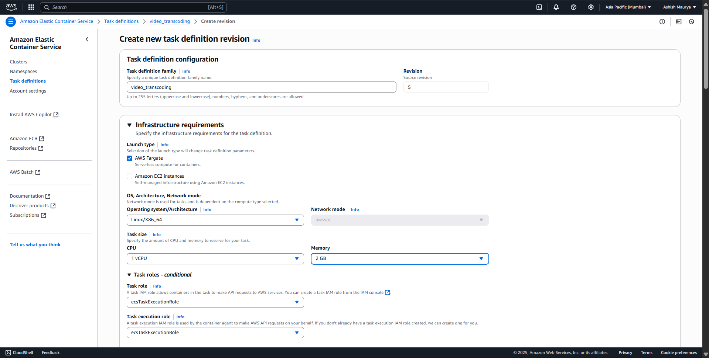
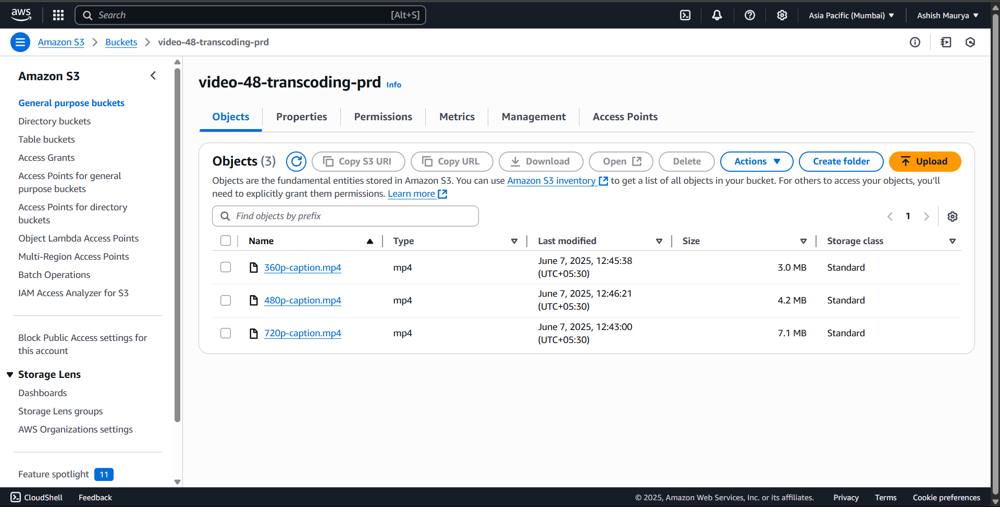

# TranscodeHub 🎬

A scalable, cloud-based video transcoding pipeline built with AWS services that automatically processes uploaded videos using FFmpeg in containerized environments.

## 📺 Demo

&nbsp;
&nbsp;

## 🏗️ Architecture

The TranscodeHub follows an event-driven architecture that ensures efficient and scalable video processing:

### Core Components

- **S3 Temp Bucket**: Temporary storage for uploaded raw videos
- **SQS Queue**: Message queue for triggering transcoding events
- **Node.js Consumers**: Scalable transcoding workers running in Docker containers
- **S3 Production Bucket**: Final storage for processed videos
- **CloudFront CDN**: Global content delivery network for optimized video streaming

### Workflow

1. **Upload**: Users upload videos to a temporary S3 bucket using presigned URLs
2. **Event Trigger**: S3 upload events automatically trigger SQS messages
3. **Processing**: Node.js consumers poll SQS, validate requests, and spin up Docker containers with FFmpeg
4. **Transcoding**: Videos are processed and converted to multiple formats/qualities
5. **Storage**: Processed videos are uploaded to the production S3 bucket
6. **Cleanup**: Docker containers are terminated, SQS messages deleted, and temp files removed
7. **Delivery**: CloudFront serves videos globally with low latency

## 🚀 Features

- **Scalable Processing**: Automatic scaling based on queue depth
- **Multiple Formats**: Support for various video formats and quality levels
- **Fault Tolerance**: Robust error handling and retry mechanisms
- **Cost Effective**: Pay-per-use model with automatic resource cleanup
- **Global Delivery**: CloudFront integration for worldwide content distribution
- **Presigned URLs**: Secure direct-to-S3 uploads without exposing credentials

## 🛠️ Tech Stack

- **Frontend**: React.js
- **Backend**: Node.js
- **Containerization**: Docker
- **Container Registry**: Amazon ECR (Elastic Container Registry)
- **Container Orchestration**: Amazon ECS (Elastic Container Service)
- **Video Processing**: FFmpeg
- **Cloud Services**: AWS (S3, SQS, CloudFront, ECS, ECR)
- **Message Queue**: Amazon SQS
- **Storage**: Amazon S3
- **CDN**: Amazon CloudFront

